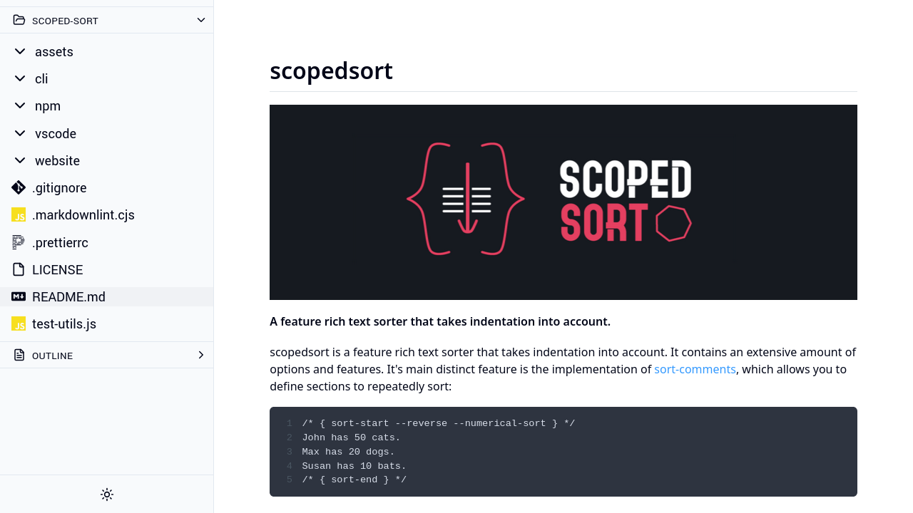

# Local Files Viewer

Simple program to view files in your browser including text files, markdown,
HTML, PDFs, images, videos, audio, and fonts.

Check out [filebrowser](https://filebrowser.org/installation), which might better
suit your needs.

## Previews

Markdown:



For more previews, visit [previews.md](previews.md)

### Security Note

I don't believe this program exposes any additional security threat, but in the
instances of one, I am not responsible for any damages.

It uses the web browser's provided API for images, videos, audios, fonts, and
iframes to display HTML & PDF content. It uses node's `fs.readFile` to read the
file contents.

## Installation

For now, you need to clone the repo and run it yourself. In the future I might
make it a NPM package.

```shell
git clone https://github.com/sixskys/local-files-viewer.git
cd
local-files-viewer npm i
```

## Usage

This program currently works by opening up a folder: your env variable of
`LFV_DEFAULT_FOLDER`. I understand it is a bit counterintuitive, but at the time
I couldn't find a way to pass in arguments to the SvelteKit program.

Opening up just a single file might be supported in the future but for now you
just have to open their parent folder.

You can use this program two ways:

1. going to this project directory changing your env variable and running `npm run dev`: `LFV_DEFAULT_FOLDER=~/Downloads/ npm run dev`
2. Use the helper script in `./lfv`, usage: `lfv <folder>`

The helper script does assume the project directory is at `~/code/local-files-viewer`, so if it's not, you will need to change it.

## Keybindings

`h` => go to previous file

`l` => go to next file

`ctrl+p` => toggle file finder

`ctrl+o` => toggle directory (allows you to change the base directory)

palette mode:

(file mode) `ctrl+j`, `tab` => next item

(file mode) `ctrl+k`, `shift+tab` => previous item

(directory mode) `tab`=> completion

(directory mode) `shift+tab` => nothing

`ctrl+m`, `enter` => select item

`ctrl+[`, `Escape` => close palette

## Technologies / Attribution

- SvelteKit, typescript, scss, etc..
- mdsvex: used to render markdown, might
  be a bit overkill since I don't use any special features mdsvex provides, might
  just switch to `markdown-it` or `micromark`. Although, I might add a feature to
  render markdown files that include svelte components, but I don't know how
  likely that is.
- shiki: used for syntax highlighting, mdsvex includes prismjs
  by default, but I don't like how they handle line highlights
- Took some inspiration from vscode ui
- Icons
  - [feather](https://feathericons.com/), only used `hash`, `file`, and `folder`, `arrow-[right|down]`, and
    `chevron-[right|down]`
  - [simple-icons](https://simpleicons.org/), used for language file icons

## Future

- Look into optimizations of reading and showing content
- Handle large directories more gracefully. Originally the idea was to load x amount deep, then when the user
  requests load more, but with the file picker I switched it back to loading
  recursively as much as needed.
- Error handling
  - Remove the need for two states of errors.
  - You should be able to change the base directory on the error page.
