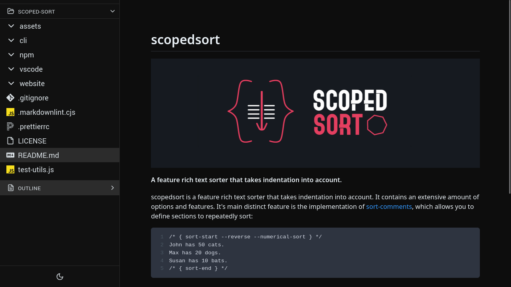

# Local Files Viewer

Simple program to view files in your browser. Text files, markdown, html, images, videos, audios, and fonts all work.

## Installation

```
git clone https://github.com/sixskys/local-files-viewer.git
cd local-files-viewer
npm i
npm run build
npm run preview
```

## Previews

Markdown:



For more previews, visit [previews.md](previews.md)

## Usage

This program currently works by opening up a folder: your env variable of `LFV_DEFAULT_FOLDER`.
I usually run this program by going to the directory of the source code, setting my env variable and
running `npm run dev`
like so: `LFV_DEFAULT_FOLDER=~/Downloads/ npm run dev`

## Keybindings

`h` => go to previous file

`l` => go to next file

`ctrl+p` => toggle file finder

`ctrl+o` => toggle directory (allows you to change the base directory)

pallete mode:

(file mode) `ctrl+j`, `tab` => next item

(file mode) `ctrl+k`, `shift+tab` => previous item

(directory mode) `tab`=> completion

(directory mode) `shift+tab` => nothing

`ctrl+m`, `enter` => select item

`ctrl+[`, `Escape` => close pallete

## Future

- More optimizations, more modularization
- Editing files? Doubtful
- Handle large directorys mor gracefully. Originally the idea was to load x amount deep, then when the user requests
  load more, but with the file picker I switched it back to loading recurisively as much as needed.
- Error handling
  - On error page, be able to change base directory
