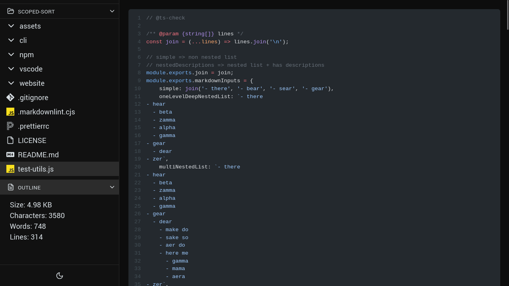

# Local Files Viewer

Simple program to view files in your browser. Text files, images, videos, audios work.

## Installation

```
git clone https://github.com/sixskys/local-files-viewer.git
cd local-files-viewer
npm i
npm run build
npm run preview
```

## Previews

Markdown:


Plain image:


Javascript:



## Usage

This program currently works by opening up a folder: your env variable of `LFV_DEFAULT_FOLDER`.
I usually run this program by going to the directory of the source code, setting my env variable and
running `npm run dev`
like so: `LFV_DEFAULT_FOLDER=~/Downloads/ npm run dev`

## Keybindings

`h` => go to previous file

`l` => go to next file

`ctrl+p` => toggle file finder

pallete mode:

`ctrl+j`, `tab` => next item

`ctrl+k`, `shift+tab` => previous item

`ctrl+m`, `enter` => select item

`ctrl+[`, `Escape` => close pallete
